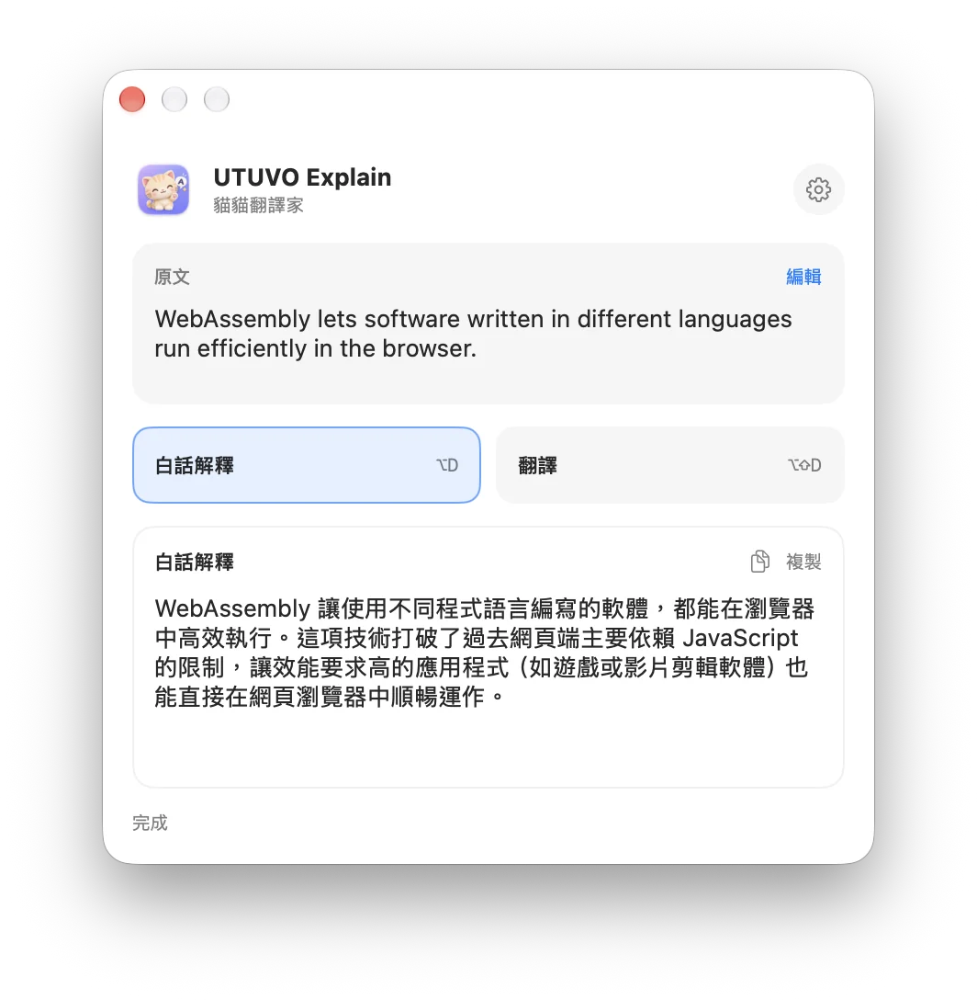
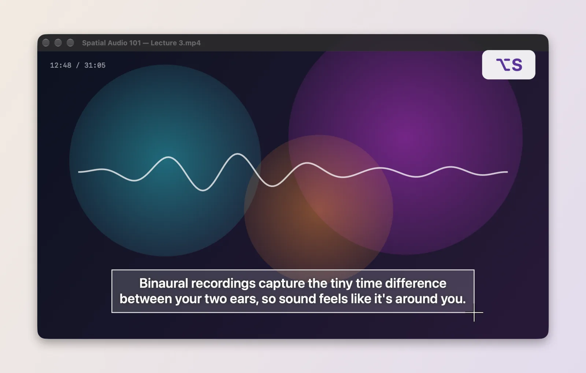
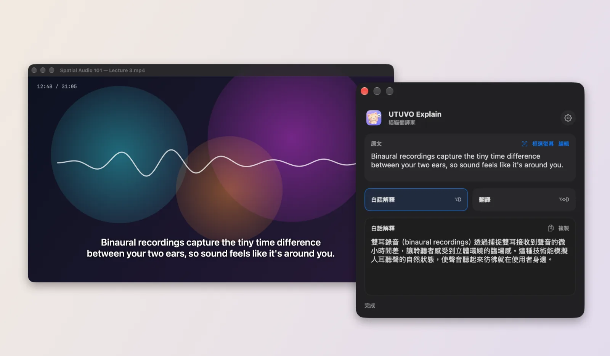

<p align="center"></p>

<h1 align="center">UTUVO Explain</h1>
<p align="center"><strong>貓貓翻譯家｜Mac 選字翻譯與白話解釋工具</strong></p>
<p align="center"><a href="https://mickyyang-1407.github.io/utuvo-explain/">產品網站</a> · <a href="https://github.com/mickyyang-1407/utuvo-explain/releases/latest">下載 DMG</a> · <a href="README.en.md">English</a> · <a href="LICENSE">MIT</a></p>

<p align="center"></p>

**macOS 14+ · Apple Silicon 安裝包 · SwiftUI + AppKit · 自備 Gemini API Key**

## 選字後按快捷鍵

| 快捷鍵 | 結果 |
| --- | --- |
| `⌥D` | 用台灣繁體中文解釋選取的文字，必要時補充術語或背景 |
| `⌥⇧D` | 非中文內容翻成台灣繁體中文；中文內容翻成英文，只顯示譯文 |
| `⌥S` | 框選螢幕上的一塊範圍，辨識裡面的字再白話解釋（圖片、影片字幕、PDF 掃描檔都適用） |
| `⌥⇧S` | 框選螢幕範圍後翻譯 |

### 框選螢幕怎麼用

| ① 按 `⌥S`，框住字幕 | ② 放開滑鼠，小視窗馬上出現 |
| --- | --- |
|  |  |

App 內建四頁「使用教學」，第一次開啟會自動出現，之後可從選單列的「使用教學…」再打開。

框選時可按空白鍵改選整個視窗，按 Esc 取消。文字辨識在 Mac 本機完成，只把辨識出的文字送給 Gemini；框選的畫面辨識完就刪除，不會上傳。辨識結果會顯示在原文欄，有錯字可以按「編輯」修正後再送一次。

結果視窗會盡量出現在選取文字旁邊。如果某個 App 抓不到選字，也可以手動貼上文字。結果可複製，兩個功能也能在視窗內切換。

## 安裝與設定

1. 從 [Releases](https://github.com/mickyyang-1407/utuvo-explain/releases/latest) 下載 `UTUVO-Explain-0.1.1-arm64.dmg`。開啟後，將 App 拖進「Applications」。安裝包已通過 Apple 簽章與公證。
2. 從「應用程式」啟動 UTUVO Explain。點右上角的設定，貼上自己的 [Gemini API Key](https://aistudio.google.com/api-keys)。API Key 會存在 Mac 鑰匙圈。
3. 第一次使用時，在 macOS 的「裝置控制和資料取用」中允許 UTUVO Explain。App 需要這項權限才能讀取選字、接收快捷鍵；不會記錄其他按鍵。
4. 要用 `⌥S` 框選螢幕文字，第一次會請你在「螢幕與系統錄音」允許 UTUVO Explain，開啟後重新啟動 App。
5. 選字後按快捷鍵，或在小視窗手動貼上文字。

App 免費，並以 MIT 授權開源。使用 Gemini 需要自己的 API Key；免費額度與資料使用規則請看 [Google 官方說明](https://ai.google.dev/gemini-api/docs/pricing)。只有你按下快捷鍵或功能按鈕，文字才會送到 Google。請勿送出敏感內容。App 不會保存翻譯或解釋的歷史。

## 自行編譯

需要 Xcode 與 [XcodeGen](https://github.com/yonaskolb/XcodeGen)。原始碼沒有內嵌 API Key，也沒有第三方執行階段套件。

```sh
xcodegen generate
xcodebuild -project UTUVOExplain.xcodeproj -scheme UTUVOExplain -configuration Debug build
```

`Scripts/build-release.sh` 需要 Developer ID 憑證；`Scripts/package-release.sh` 另需 Apple 公證用的 Keychain profile。發行版目前只驗證 Apple Silicon，Intel Mac 尚未驗證。如果某個 App 不提供選字內容，Explain 會嘗試暫時複製選字，再還原剪貼簿；無法安全還原時，會請你手動貼上。

## 開源

歡迎提出 issue 或 PR。[MIT 授權](LICENSE)；發現安全問題請參閱 [SECURITY.md](SECURITY.md)。
